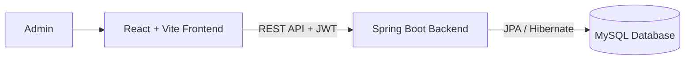

# Hospital Management System

### Full Stack Doctor, Patient & Appointment Management System

A modern full-stack Hospital Management System built using React, Spring Boot, MySQL, JWT Authentication, and Tailwind CSS.

The system allows secure management of doctors, patients, and appointments with protected APIs, appointment workflow tracking, dashboard analytics, and responsive UI.

---

# 🚀 Features

## 🔐 Authentication & Security

- JWT Authentication
- Secure Login System
- Protected Frontend Routes
- Protected Backend APIs
- Spring Security Integration
- Token-based Authorization

---

# 👨‍⚕️ Doctor Management

- Add doctors
- Update doctor details
- Delete doctors
- Search doctors by name
- Dynamic doctor listing
- Responsive table UI

---

# 🧑‍⚕️ Patient Management

- Add patients
- Update patient details
- Delete patients
- Store disease information
- Manage patient records
- Responsive patient table

---

# 📅 Appointment Management

- Book appointments
- Dynamic doctor & patient selection
- Appointment workflow system

```text
PENDING
→ APPROVED
→ COMPLETED
→ CANCELLED
```

- Live status updates
- Status color mapping
- Delete appointments
- Appointment dashboard tracking

---

# 📊 Dashboard

- Total doctors
- Total patients
- Total appointments
- Pending appointments
- Completed appointments
- Recent appointment activity

---

# 🛠️ Tech Stack

## Frontend

- React
- Vite
- Tailwind CSS
- React Router
- Axios

---

## Backend & Database

- Spring Boot
- Spring Security
- JWT Authentication
- Java 17
- Hibernate / JPA
- MySQL

---

## Tools

- Maven
- NPM
- Git

---

# 🏛️ Architecture



---

# 📂 Folder Structure

```text
hospital_management_system/
│
├── backend/
│   └── src/main/java/com/shravan/backend/
│       ├── config/
│       │   ├── JwtFilter.java
│       │   └── SecurityConfig.java
│       │
│       ├── controller/
│       │   ├── AuthController.java
│       │   ├── DoctorController.java
│       │   ├── PatientController.java
│       │   └── AppointmentController.java
│       │
│       ├── dto/
│       │   ├── AuthRequest.java
│       │   ├── AppointmentRequest.java
│       │   └── AppointmentResponse.java
│       │
│       ├── entity/
│       │   ├── Doctor.java
│       │   ├── Patient.java
│       │   └── Appointment.java
│       │
│       ├── repository/
│       │   ├── DoctorRepository.java
│       │   ├── PatientRepository.java
│       │   └── AppointmentRepository.java
│       │
│       ├── security/
│       │   └── JwtUtil.java
│       │
│       └── service/
│           ├── DoctorService.java
│           ├── PatientService.java
│           ├── AppointmentService.java
│           └── impl/
│
├── frontend/
│   └── src/
│       ├── components/
│       │   ├── Navbar.jsx
│       │   └── ProtectedRoute.jsx
│       │
│       ├── pages/
│       │   ├── Dashboard.jsx
│       │   ├── Doctors.jsx
│       │   ├── Patients.jsx
│       │   ├── Appointments.jsx
│       │   └── Login.jsx
│       │
│       ├── services/
│       │   ├── doctorService.jsx
│       │   ├── patientService.jsx
│       │   └── appointmentService.jsx
│       │
│       ├── App.jsx
│       └── main.jsx
│
└── README.md
```

---

# ⚙️ Local Setup

## 📌 Prerequisites

- Java 17+
- Node.js 18+
- MySQL
- Maven

---

# 1️⃣ Clone Repository

```bash
git clone https://github.com/Shravan21105/Appointnemt-Management-System.git
```

---

# 2️⃣ Database Setup

Create database:

```sql
CREATE DATABASE hospital_management_system;
```

Update:

```text
backend/src/main/resources/application.properties
```

Example:

```properties
spring.datasource.url=jdbc:mysql://localhost:3306/hospital_management_system
spring.datasource.username=root
spring.datasource.password=your_password

spring.jpa.hibernate.ddl-auto=update
```

---

# 3️⃣ Backend Setup

```bash
cd backend

# Windows
.\mvnw.cmd spring-boot:run

# Mac/Linux
./mvnw spring-boot:run
```

Backend runs on:

```text
http://localhost:8080
```

---

# 4️⃣ Frontend Setup

```bash
cd frontend

npm install

npm run dev
```

Frontend runs on:

```text
http://localhost:5173
```

---

# 🔑 Default Login Credentials

| Field | Value |
|------|------|
| Username | `admin` |
| Password | `admin123` |

Login Route:

```text
http://localhost:5173/login
```

---

# 🔌 API Reference

## 🔐 Authentication APIs

| Method | Endpoint | Description |
|------|------|------|
| POST | `/auth/login` | Login & JWT generation |

---

## 👨‍⚕️ Doctor APIs

| Method | Endpoint | Description |
|------|------|------|
| GET | `/api/doctors` | Get all doctors |
| GET | `/api/doctors/{id}` | Get doctor by ID |
| POST | `/api/doctors` | Add doctor |
| PUT | `/api/doctors/{id}` | Update doctor |
| DELETE | `/api/doctors/{id}` | Delete doctor |

---

## 🧑‍⚕️ Patient APIs

| Method | Endpoint | Description |
|------|------|------|
| GET | `/api/patients` | Get all patients |
| GET | `/api/patients/{id}` | Get patient by ID |
| POST | `/api/patients` | Add patient |
| PUT | `/api/patients/{id}` | Update patient |
| DELETE | `/api/patients/{id}` | Delete patient |

---

## 📅 Appointment APIs

| Method | Endpoint | Description |
|------|------|------|
| GET | `/api/appointments` | Get all appointments |
| POST | `/api/appointments` | Book appointment |
| PUT | `/api/appointments/{id}/status` | Update appointment status |
| DELETE | `/api/appointments/{id}` | Delete appointment |

---

# 📸 Current Workflow

## 🔐 Admin Login

- Secure login using JWT
- Token stored in localStorage
- Protected routes after login

---

## 👨‍⚕️ Doctor Workflow

- Add doctor
- Update doctor
- Delete doctor
- Search doctor

---

## 🧑‍⚕️ Patient Workflow

- Add patient
- Update patient
- Delete patient

---

## 📅 Appointment Workflow

- Book appointment
- Select doctor & patient dynamically
- Update appointment status
- Delete appointment
- Monitor status from dashboard

---

# 🛠️ Troubleshooting

## ❌ Port 8080 already in use

```bash
netstat -ano | findstr :8080
taskkill /PID <PID> /F
```

---

## ❌ CORS Errors

Make sure backend contains:

```java
@CrossOrigin(origins = "http://localhost:5173")
```

---

## ❌ Wrong Java Version

Check Java version:

```bash
java -version
```

Requires Java 17+.

---

# 🔮 Future Improvements

- Charts & analytics
- Pagination
- Email notifications
- Role-based access
- Doctor availability scheduling
- Toast notifications
- Dark mode
- Advanced filtering
